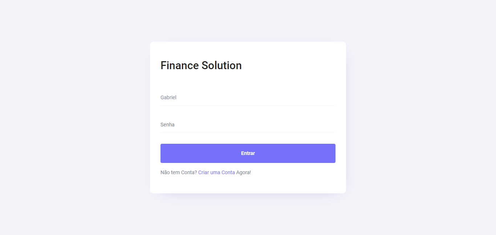

# Fincance Solution

O projeto Finance Solution de principio tem como principal intuito ajudar todos os seus usuarios a terem uma melhor visão financeira. Conseguindo de forma simples, gerenciar o seu dinheiro economizando em diversas pontas.

Tem como um de deus pontos positivos a facilidade de uso, pois possui uma interface simples e intuitiva, permitindo que todos os usuarios possam ter uma melhor visão financeira.

<p align="center">  </p>

# Desenvolvedores

É Necessario a aqueles que vão trabalhar no projeto, que sigam os passos abaixo para que o o ambiente de desenvolvimento esteja devidamente configurado para uso.

E um dos principais passos para quem usa o prompt de comando, é necessario que o mesmo esteja no diretorio do projeto.
```
..\FinanceSolution\
```

## Banco de Dados

Todos os comandos que vão ser executados para configurar o banco de dados, devem ser executados no diretorio do projeto Data.
```
`..\FinanceSolution\FinanceSolution.Data`,
```

### Comandos para Migration

Para gerar uma migração nova, é necessario o comando `dotnet ef --startup-project ..\FinanceSolution.Inteface migrations add ****`, lembrando que onde se encontra os asteriscos deve ser sempre mudado para o nome da migration. 

Para remover uma migração é necessario executar o comando `dotnet ef --startup-project ..\FinanceSolution.Inteface migrations remove`, para remover uma migration especificar é somente necessario colocar o nome da propria na frente do remove.

### Comandos para Banco

Para atualizar o banco de dados por meio de comandos, usando o entity framework, é necessario somente rodar `dotnet ef --startup-project ..\FinanceSolution.Inteface  database update`.

E caso seja necesserario, é possivel dar drop do banco de dados por comando, `dotnet ef --startup-project ..\FinanceSolution.Inteface database drop`.

## Publicação do Projeto

...
